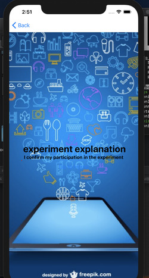
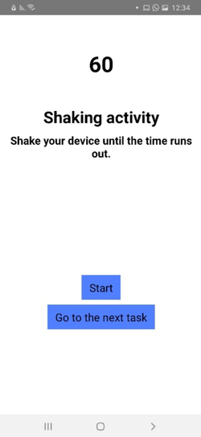
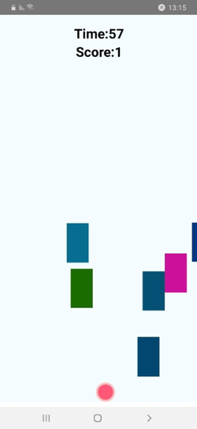

# SDIOS-data-collection
  

Sensor defense In-software (SDIOS) project: This directory contains a system for data collection (application and server). Seven activities were measured - phone at rest, phone in pocket, shaking the phone, texting, walking, running (was stairs), and playing a game.

The application is implemented in ReactNative and is suitable for running on Android and iPhone.

Prerequisite: Download the EXPO app from your application store.
To execute the application:
```sh
cd app
npm install
npm start
```

To execute server:
```bash
cd Backend/fileServer
setup.sh
python fileServerNHTTP.py
```

Next, scan the QR code with a test device to initiate the data collection process.
