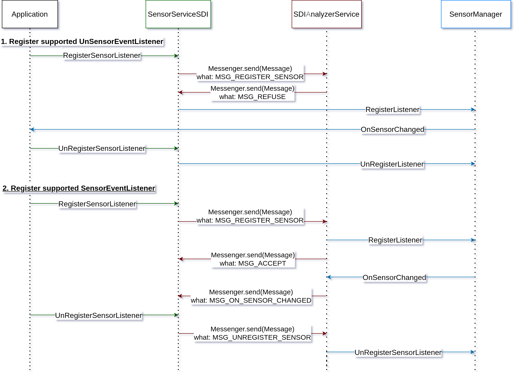

# SDIOS Client Library
The SDIOS-library implementation.

In order for SDIOS (library or SDIOS) to work, make sure [SDIOS-Service application](../../SDIOSTFliteService/) is installed on the device.

Any application will be SDIOS protected on [SDIOS](../../../SDIOS/). 
However, in some cases, we prefer to keep our phone OS the same.

We can compile our applications with the SDIOS-Library to protect our applications without changing the OS.

## The library and the service
For SDIOS to work (library or SDIOS), ensure the SDIOS-Service application is installed on the device.

The SDIOS-Library communicates with the [SDIOS-Service](../SDIOSTFliteService/) to get SensorEvents scanned for anomalies.
The communication is as follows:

## Library usage
The library has its own SensorManager, SensorEventListener, and SensorEvent (with trust).
A developer should use the instances provided by the library to get SensorEvent scanned by the SDIOS-Service.

Not every SensorManager function has library support. Here is a table to note which is supported.

You can see the SDIOS-supported SensorManager function [here](./SupportedSensorManagerFunctionality.md).

## More interaction examples with the SDIOS-Library
See [integration with SDIOS-Library](../../IntegratingLibraryIntoExistingApplication/).
