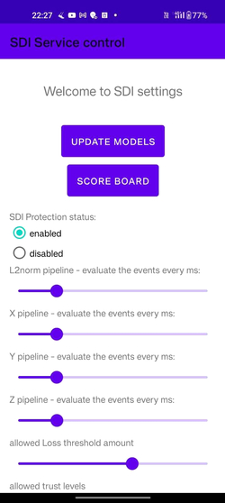
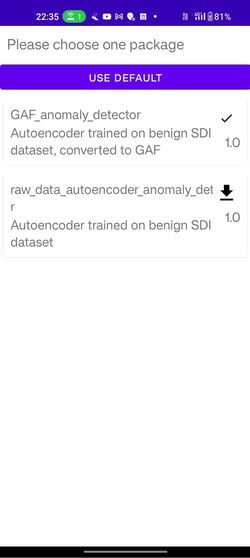
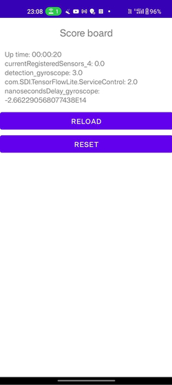
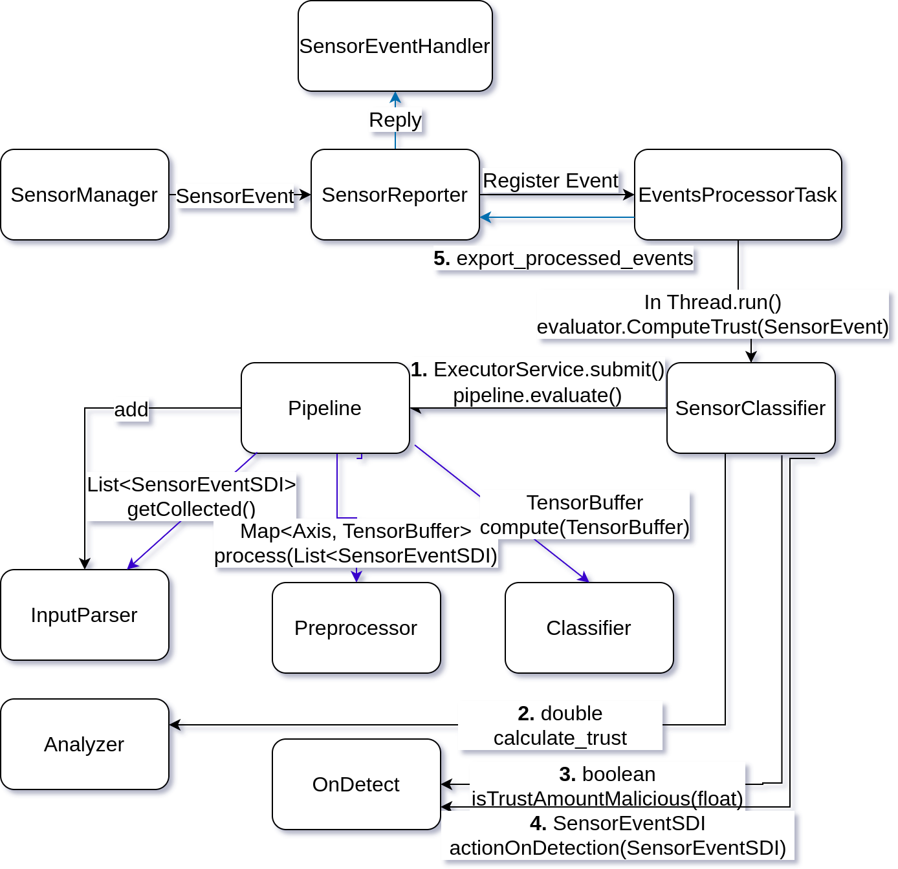

# SDIOS TensorFlow lite analyzing service
  

The SDIOS-Service application is a core part of SDIOS.

In this application, the user chooses an SDIOS package. Each package can define which sensors it supports and which parameters the user can modify.

This application can receive a request to register a sensorEventListener. It registers with the original Android SensorManager. When it gets new SensorEvents, it preprocesses and evaluates them with a user-defined TFLite model. When the TFLite model detects an anomaly, the user-defined package can configure what action to take. For example, it can block new events, return events with zeros, return new events as is, and so on.

This application has a service that other applications can use to communicate through the [SDIOS-Library](../SDIOSTFliteClient/SDIOSClientLib/) or the [framework](../../SDIOS/).

Read more on communication [here](./Communication.md).

## Dealing with battery optimizations
When testing the SDIOS-Service application and library on non-SDIOS distributions, we encountered the SDIOS-Service application being killed. We discovered that the service application could be forced to close on some Android OS distributions due to battery optimization. To prevent this, a user can turn off the battery optimization for the SDIOS-Service to allow it to always work in the background.

# SDIOS-Packages
Packages define how the sensor's output will be preprocessed and how to react upon detection.
The packages provide options to set each package parameter in the SDIOS-Service menu.

See package example [here](../../SDIOS/models_server/model_controller/).

You can see the full classes listing [here](./Interfaces.md) of the actions and classes that can be used in the package.
