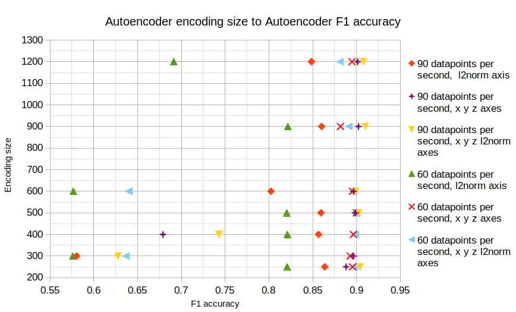
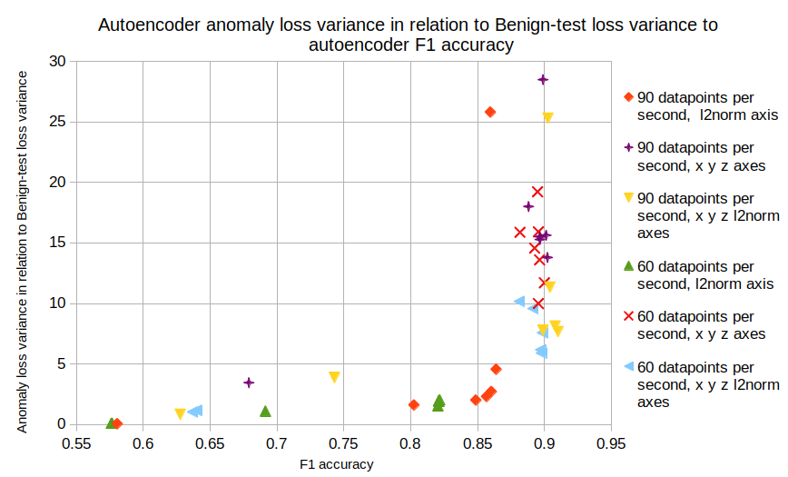

# Choosing GAF model parameters
Here, we will explain how we choose GAF parameters.

The GAF autoencoder has many parameters. We have researched to find the parameters that yield the best metrics.

Our autoencoder should encode and decode the trained-benign data with low loss values and fail to encode and decode over untrained data such as anomalies and untrained benign activities with high loss values.
We should fine-tune our autoencoder parameters to achieve a reasonable detection rate. For example, which axes should we use? What encoding size should we use? What is the best number of events per second?
The model was first trained on the benign training dataset and performed relatively well with low loss. We calculate the threshold from the benign training dataset and then use this threshold to classify anomalies and benign test datasets.
Since the dataset is too big, we evaluate a portion of it --- 4000 samples from the benign test dataset and the anomalies dataset (slightly lower than 4000).
The benign test and train datasets are randomized for each run. However, we ensure that the train test split of benign data remains consistent during the evaluation phase.

## Encoding size
### Comparison of best Gyroscope autoencoder performance with various model parameters
| Axes             | Sample data points | Encoding size | Accuracy | Recall | F1 | Threshold | Benign train span | Benign test span | Anomalous span |
| :--------------- | :----------------- | :-----------: | :------: | :----: | :-: | :------: | :---------------: | :--------------: | :------------: |
| X, Y, Z, l2norm  | 90 | 900 | 0.921 | 0.88  |**0.91** | 0.045930 | 0.010418 - 0.038033 | 0.011696 - 0.041380 | 0.045930 - 0.128187 |
| X, Y, Z          | 90 | 900 | 0.917 | 0.843 |  0.902  | 0.039177 | 0.005465 - 0.023492 | 0.006121 - 0.025664 | 0.023413 - 0.096020 |
| l2norm           | 90 | 250 | 0.882 | 0.82  |  0.863  | 0.014957 | 0.004012 - 0.015743 | 0.004365 - 0.016761 | 0.014957 - 0.041436 |
| X, Y, Z, l2norm  | 60 | 500 | 0.914 | 0.844 |  0.90   | 0.024082 | 0.004305 - 0.024213 | 0.005247 - 0.026237 | 0.024082 - 0.095901 |
| X, Y, Z          | 60 | 400 | 0.912 | 0.854 |**0.898**| 0.043747 | 0.011742 - 0.041095 | 0.013290 - 0.044166 | 0.043747 - 0.128750 |
| l2norm           | 60 | 900 | 0.839 | 0.815 |  0.821  | 0.015126 | 0.004015 - 0.015559 | 0.004600 - 0.017027 | 0.015126 - 0.032909 |


### Performance of GAF Autoencoder for Accelerometer and Magnetometer
We did not collect malicious data for the sensors: Accelerometer and Magnetometer. We tested only the autoencoder performance on benign data.

| Sensor        | Axes | Sample data points | Encoding size | Benign accuracy | Threshold | Benign train span | Benign test span |
| :------------ | :-------------- |:-: |:--: | :------: | :------: | :-----------------: | :-----------------: |
| Accelerometer | X, Y, Z, l2norm | 60 | 300 |  0.8285  | 0.040361 | 0.013610 - 0.040361 | 0.015225 - 0.043299 |
| Accelerometer | X, Y, Z         | 60 | 300 |  0.8285  | 0.031026 | 0.010680 - 0.031026 | 0.012008 - 0.033510 |
| Magnetometer  | X, Y, Z, l2norm | 30 | 300 |  0.8042  | 0.043811 | 0.013602 - 0.043811 | 0.013591 - 0.046440 |
| Magnetometer  | X, Y, Z         | 30 | 300 |**0.8082**| 0.033060 | 0.008661 - 0.033060 | 0.008520 - 0.035194 |
| Magnetometer  | X, Y, Z, l2norm | 60 | 300 |  0.7875  | 0.038794 | 0.007689 - 0.038794 | 0.008074 - 0.041614 |
| Magnetometer  | X, Y, Z         | 60 | 300 |  0.7905  | 0.029206 | 0.004518 - 0.029206 | 0.004643 - 0.031627 |

### Autoencoder encoding size to the f1 score


The figure above shows the relation between autoencoder encoding size and the f1 score. Encoding size is the size of the encoded data vector forward from the encoder to the decoder. This graph shows that the encoding size does not significantly affect the F1 value.
Please pay attention to the phenomenon that each combination resides on the same F1 score, creating a column in the graph. We can see out-of-the-norm results for encoding sizes of 300 and 600 combined with 60 data points per second and encoding sizes of 300 and 400 combined with 90 data points per second.
These bad F1 results can happen if the model fails at the training phase to reduce its loss value for encoding and decoding benign data. The model will perform unwell on benign data, making it a wrong candidate for anomaly detection.
Looking through the results, without diving too deep into the exact accuracy, we can see in the figure that the combination of x, y, z, l2norm or x, y, z axes with 60 or 90 data points per second resulted in the best F1 score—around 90 percent. We can also infer from the figure that the autoencoder encoding size has little to no impact on the F1 score.

## The relation between anomaly loss variance and benign loss variance affects the F1 score


The figure above shows a graph showing the relation between anomaly loss variance and benign test loss variance and how this affects the F1 score. This graph shows that higher anomaly loss variance positively affects the F1 score up to some magnitude.
We use std to calculate the best value for the threshold, as discussed in \cref{gaf_autoencoder_detection}.
$variance = std^2 = \sigma^2$; hence, the models with the more significant anomaly loss variance make it easier to choose a threshold to differentiate anomaly from benign.
In addition, we can see that the models with an anomaly loss variance bigger than at least five times the benign test loss variance perform very well on the F1 score. High variance on anomaly loss means that the autoencoder does not perform well on the anomaly samples as we intended.
In the table below, we compare the best model performance with various model parameters. We have tested many configurations. For 60 and 90 data points per second, we have tested $[X, Y, Z | l2norm]*[250, 300, 400, 500, 600, 900, 1200]$; we have brought to this table only the best results in each category since there are many results.
From the results, the best configuration is to use four axes, X, Y, Z, and l2norm, with an encoding size of 900 and 90 data points per second. It is in the first row of the table with the F1 score bolded.
The results make sense since the loss of anomalies is more prominent in 180x180 compared to 120x120, making it easier to detect anomalies, assuming that the autoencoder works well with benign data and the loss of the benign stays low; in our case, the anomaly average loss was 0.087 while the benign test average loss was 0.0265.
In addition, from a statistical view, this model is great since it has complete isolation between the benign test loss span and the anomaly loss span; however, it does not guarantee absolute accuracy since values may reside outside of the span.
The table presents two best-performing autoencoders. The first autoencoder comprises X, Y, Z, and l2norm, a GAF image with a 90HZ sampling rate and a 900 encoding size. The second autoencoder includes X, Y, Z, GAF 60HZ, and a 400 encoding size. The first autoencoder is more accurate than the second autoencoder.
However, the second autoencoder has smaller encoding—fewer neurons—and requires three axes—less processing, contrary to the four axes needed for the first autoencoder.
So, choosing the second autoencoder results in a small loss of accuracy but more performance, which is essential since smartphone resources are limited.

## Summary
In this experiment, we reviewed our model parameters and showed why we chose them by comparing their performance with other parameters. The chosen configuration is the GAF 60HZ sampling rate. We showed that the encoding rate does not affect the F1 results, and therefore, choosing the smallest will bring the most minimized model and best performance.


## Implementation
The code block below shows the encoding size testing and full implementation in the [`autoencoder_gaf.ipynb`](./autoencoder_gaf.ipynb).
```
ENCODING_SIZES = [250, 300, 400, 500, 600, 900, 1200]
run_for_encoding_size()
```
