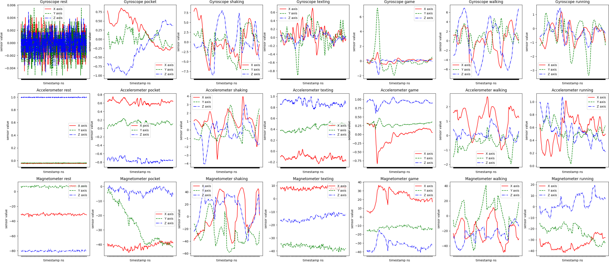
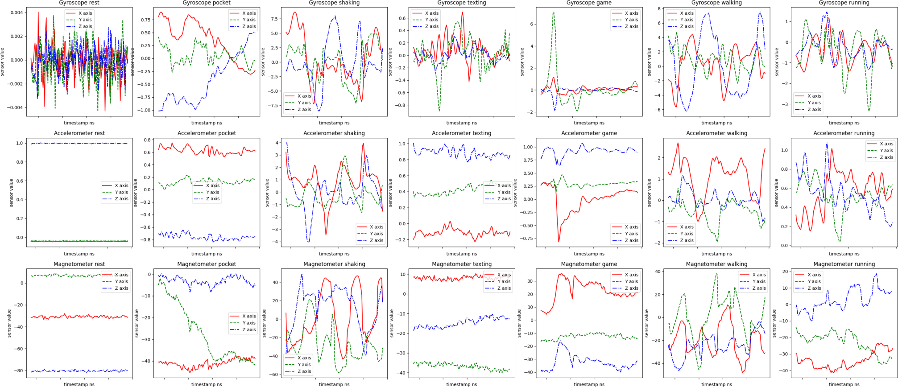
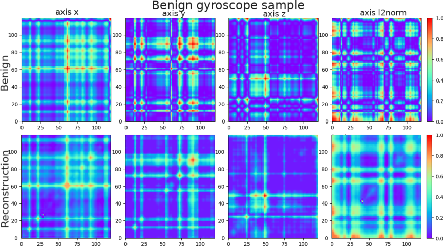
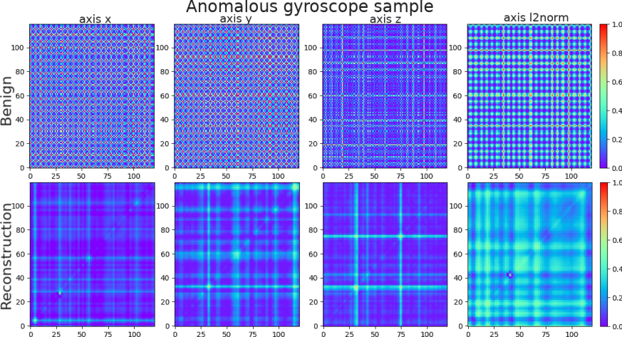
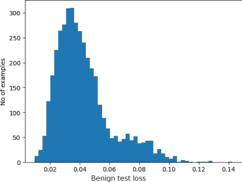
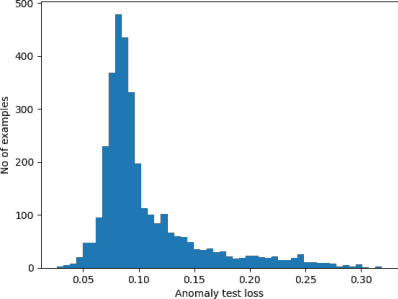

# GAF (Garmian Angular Fields)

We focused on creating an anomaly detection model using only benign data. Our benign data was collected with our [activity sensor collection app](../Applications/DataCollection/).
The test anomalous data was collected for gyroscope only for a couple of devices, using our [automated resonance search application](../Applications/AutomatedResonanceSearch/).

In this part, we showcase our tools to create TensorFlow models to detect anomalies in the SensorEvent stream.

Our data is a time series of SensorEvents; each SensorEvent includes three axes, x, y, and z, since the accelerometer, gyroscope, and magnetometer provide SensorEvents for the surrounding three-dimensional environment.

[GAF](https://arxiv.org/abs/1506.00327) is a method for converting a data time series of N elements to an image with dimensions NxN, helping us use potent image recognition tools for our problem.

We create an autoencoder for preprocessed data in the GAF summation form.

The following images present raw data, preprocessing, and GAF summation forms.





The autoencoder trains only on benign data to specialize in reconstructing benign data.
Visual representations of the GAF of benign and anomaly data clearly demonstrate our autoencoder approach. While we achieve low mistakes-loss when reconstructing benign data, there are visible mistakes when reconstructing the anomalous samples, resulting in high loss. Setting a loss threshold can identify these mistakes as anomalous.
The two bottom graphs show that the mean anomalous loss was around 0.1, while the mean benign loss was below 0.04.

 
 

In the [notebook 'gaf_all_axes_300.ipynb'](./gaf_all_axes_300.ipynb) you can see our actual model training and results.

## Dataset
Due to privacy issues, we did not include our database here.
However, you can easily create your own with our [activity sensor collection app](../Applications/DataCollection/).

## Setup
### Setup for conda Nvidia
```bash
setup_conda_env.sh
```

### Setup for CPU
Alternatively, you can install the requirements.txt and execute the .ipynb on your CPU.

## Pull the samples to an accessible location
Run `prepropcessing/preprocess_csv.py` to convert .csv data collected with [Data collection app](../Applications/DataCollection/) to samples of x, y, z, and l2norm with fixed-time incrementation data.
Fix time to fixed points - choose sampling rate, for example, 60hz. The algorithm will calculate point p1<-x---->p2; dp1=distance(x,p1); dp2=distance(x,p2); dtot=dp1+dp2; x=p1*dp1/dtot + p2*dp2/dtot so the points will be fixed to the time sampling.

Run autoencoder_gaf_prepare.ipynb for your sampling rate and sensor, and convert the samples to GAF samples. This step is optional; using Preprocessor will run it for every current batch.

Now, the samples are saved as compressed GAF samples.


## Use the data in your notebook
Run your notebook `autoencoder_gaf.ipynb` to train models. If you have enough (a lot) of RAM, you can use `autoencoder_gaf_all_in_memory.ipynb`.

Please notice the following functions:
```py
# contains your datasets
anomaly/train_dataset = GAFDatasetLoader(...)

# Calculate the autoencoder threshold for anomaly and benign. The threshold is the sum of all the sub-autoencoder's losses and is calculated by the loss of the training dataset's subset. The calculation is the mean of the loss +/- std.
calculate_thresholds(autoencoder)

# Write data about the autoencoder and its performance
log_results(autoencoder)


produce_model_and_evaluate_axes(encoding_size):
    # The model trains by the response of all the axes per sensor - define which axes to use
 set_axes_dataset(AXES)
    # trains the autoencoder
 autoencoder = train_model_and_save_results(AXES, encoding_size)


# Run produce_model_and_evaluate_axes with different encodings
run_for_encoding_size()
```

You can use it as a template, and access the processed data is accessible through.

```py
extractor = RawExtractor(resample_amount=RESAMPLE_MS)
preprocess = Preprocessor(extractor, translators=[GafTranslator(AXIS_WINDOWS_AMOUNT, WINDOWS)], packed_windows=WINDOWS, path=PATH)
anomalies_preprocess = Preprocessor(extractor, translators=[GafTranslator(AXIS_WINDOWS_AMOUNT, WINDOWS)], packed_windows=WINDOWS, path=ANOMALIES_PATH)
```

## Gaf parameters
Read mroe here: [Choosing GAF model parameters](./GAF_parameters.md)
