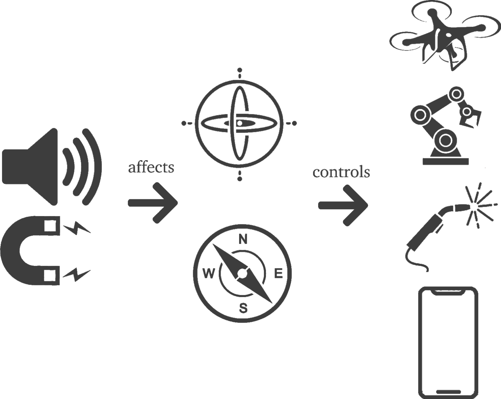

# SDIOS

SDIOS (Sensor Defense In software) is a project started at Professor [Yossi Oren's lab](https://orenlab.sise.bgu.ac.il/) at [Ben-Gurion University of the Negev](https://www.bgu.ac.il/en/).

In short, we protect MEMS sensors against acoustic attacks.

In [previous research](https://doi.org/10.1016/j.engappai.2020.103904), we presented SDIOS as a system to defend embedded systems.

In this research we present SDIOS Android operation system which capable of finding anomalies in sensors output and react to the anomalies before it reached reling applications on the device.

## What is this about?

### MEMS
MEMS (Micro Electro Mechanical System) sensors are compact devices integrated into various electronic gadgets, such as smartphones, microcontrollers, and edge devices. They furnish real-time data regarding the device's position, orientation, and motion, which is pivotal in ensuring the successful execution of device functions. The standard MEMS sensors include the accelerometer, gyroscope, and magnetometer. As technology continues to advance, an increasing number of applications rely on these sensors to make critical decisions.
Due to their diminutive size and measurement methodology, MEMS sensors are susceptible to exploitation by acoustic and magnetic attacks, which can manipulate their outputs. Previous research has showcased software-based mitigations against these vulnerabilities.

### Android OS
Android OS, an operating system used in smartphones, smart televisions, and smartwatches, incorporates MEMS sensors as user inputs for controlling device behavior. The research presented in this study focuses on implementing software-based defenses for Android OS, leveraging the **LineageOS** project. We introduce **SDIOS**, a modified version of Android OS that protects any application that utilizes sensor outputs without necessitating adjustments to the respective applications. LineageOS is an up-to-date fork of AndroidOS that can be compiled into many popular devices. 

### SDIOS
**SDIOS** represents a customized version of LineageOS, wherein we have modified the default API for sensor querying. This alteration entails the default API interacting with a specialized intermediary application.
This intermediary application, called [SDIOS-Service](Applications/SDIOSTFliteClient/), is responsible for querying sensors and transmitting sensor events. Moreover, it conducts a machine-learning sensor output analysis to detect anomalies. Additionally, the application can dynamically load [TensorFlow Lite models](GAF) and offers configurable settings for preprocessing the sensor data. Furthermore, it can execute predefined actions upon anomaly detection, safeguarding every sensor-based application.
A notable enhancement introduced by the new API incorporates a 'trust' value included with each sensor event. This value estimates anomaly derived from a machine-learning model analysis of the incoming sensor event.
We also implemented [SDIOS-Library](Applications/SDIOSTFliteClient/SDIOSClientLib/) that supports SDIOS protection when integrating with existing applications. It operates without changing the device's original operation system.

In the following research, we evaluated **SDIOS** models anomaly detection against a well-known acoustic attack showcased in previous research. While achieving an F1 result of 0.9 on our datasets, we reach an F1 result of 0.4 on average in the real-time black box testing. 
Smartphones have limited resources. Therefore, we evaluated **SDIOS** resource consumption; the CPU, RAM, and battery consumption on **SDIOS** were high while using the protected sensors. On **SDIOS**, the energy consumption for each sensor alone was twice that of LineageOS. CPU consumption and RAM were high, with an average of 55 percent of CPU 600MB RAM and 517MB disk space for the SDIOS analyzing service.
Finally, this research addresses compatibility considerations with Android applications. **SDIOS** was able to load applications without any crashing. We also evaluated that, on average, fifteen lines of code and seven file changes are required to [integrate our library with an existing application](Applications/IntegratingLibraryIntoExistingApplication/). 
It shows how minimal effort is required to add SDIOS protection on non **SDIOS** devices.

To summarize, we created **SDIOS**, a robust, comprehensive, and configurable system for detecting and responding to sensor attacks. The system can be deployed on many Android devices while maintaining compatibility and is easy to integrate.
Our anomaly detection method performed poorly in detecting real-time attacks. Future research can focus on integrating more advanced detection methods with **SDIOS** while testing against more varied attack situations.
