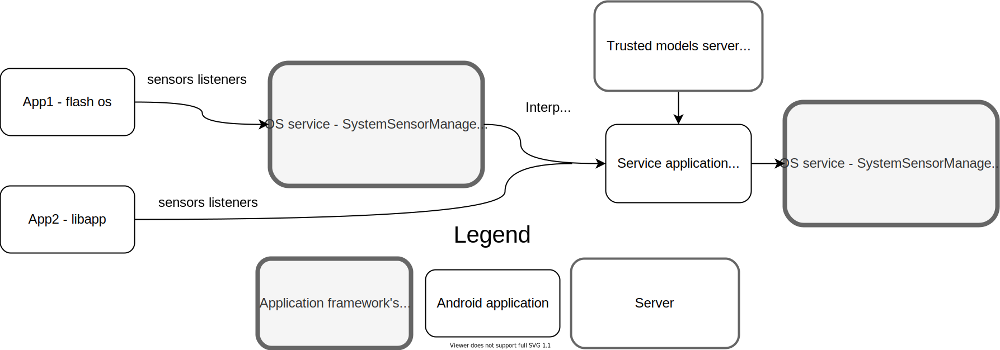

# SDIOS

## Tested devices
SDIOS has been tested on four devices.
|Phone name     | Codename | Release year | Supported LineageOS version  | Amount |
| :------------ | :-------: | :--: | :--: |:-:|
|LG G2          | d802      | 2013 | 18.1 | 2 |
|OnePlus 3T     | oneplus3  | 2016 | 18.1 | 2 |
|OnePlus 7 Pro  | guacamole | 2019 | 20.0 | 2 |
|Xiaomi Redmi 9 | lancelot  | 2020 | 20.0 | 2 |

## SDIOS products
1. The [SDIOS-Service app](../Applications/SDIOSTFliteService/) (.apk file) analyzes sensor events and gives the label 'trust'.
The application source code is located at (../Applications/SDIOSTFliteService).

2. The [SDIOS library](../Applications/SDIOSTFliteClient/SDIOSClientLib/) (.aar file). Communicates with the SDIOS app.
The library source code located at the application SDIOSTFliteClient (../Applications/SDIOSTFliteClient) uses inter-process communication with the SDIOS-service application. To use the library, add it to your application (aar/SDIOSClientLib-debug.aar).
See also [itegrating with the library](../Applications/IntegratingLibraryIntoExistingApplication/).

3. Change the [framework code](./SDIOS_framework_code/) to support SDIOS protection for any application without modifying the application.

4. Trusted [SDIOS-Packages server](./models_server/) to let users pick the most suitable package.

## How to use SDIOS without flash
The library lets you get SDIOS events without flashing your device.
Instead of getting events from the OS, you will use the library SensorManger to register SensorEventListener.

### Work with the library
Add the library to your project in either of the following ways (if you created the library module within the same project, then it is already there, and you can skip this step):
1. Add the compiled AAR (or JAR) file (the library must be already built):
Click File > New > New Module.
Click Import .JAR/.AAR Package, then click Next.
Enter the location of the compiled AAR or JAR file, and then click Finish.
2. Import the library module to your project (the library source becomes part of your project):
Click File > New > Import-Module.
Enter the location of the library module directory, then click Finish.
The library module is copied to your project so that you can edit the library code.

## How to use SDIOS with flash
We replaced the original Sensor-Manager in the application framework with SensorManagerSdios.
An application can call the `'sensors_raw'` service instead of `'sensors'` to get the original Sensor-Manager.

### Finalize
Try applications on your new OS. Integrate with the library to get trust value. Use the SDIOS-Service application to monitor the service's status.
